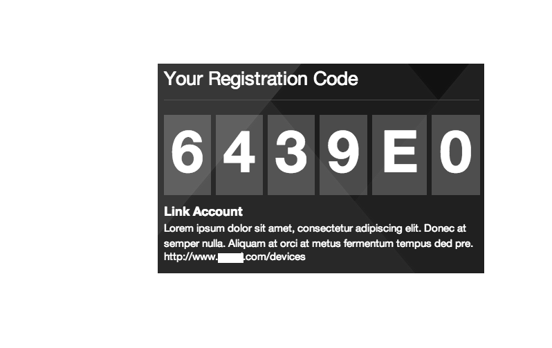

<i><b>To-Do:</b> An example of a user registration/login module and example front-end UI; generate fake device id for examples</i>  
<h1><b>Reference Rendezvous Implementation </b></h1>
by James B. Pollack - <a href='mailto:james@adifferentengine.com'>james@adifferentengine.com</a> - <a href="http://adifferentengine.com">A Different Engine</a>  
<b>Overview:</b> 
This pattern is used to link a device, such as a Smart TV or Roku, with a particular user account.  It minimizes user input on the device itself due to limited input modalities.  

<h2><b>Table of Contents</b> </h2>
* The Pattern
* Dependencies
* Setup (1,2,3)
* Using (1,2,3,4,5,6)
* Screenshots

<h3><b>The Pattern: </h3>

--The client requests a registration code from the server by sending it a device ID. 
--The server generates a registration code and returns it to the client. 
--The client displays the code to the user. 
--The user enters their account information, along with the registration code, on the provider website. 
--The provider verifies the account and sends a message to the server with the registration code and an expiration date for the subscription. 
--The server associates the registration code with the device ID and authorizes the subscription. 
--The client polls the server until it recieves authorization and changes state*. 
--The database will use its expiration functions to purge both old registration codes and old subscriptions. 
 
*I would like to replace this step with a socket to prevent unnecessary polling, but device support is not yet robust. 

<h3><b>Dependencies:</b></h3>
see Setup for installation notes 
<b>server:</b> node.js  
<b>database:</b> mongodb 
<b>node modules: </b> 
restify connect mongoose ms node-uuid (and an included modified local version of mongoose-ttl)
 

<!-- //user auth stuff, not needed yet 
bcrypt 
passport 
passport-local 
passport-local-mongoose  
 -->

<h3>Setup:</h3>
<b>Setup #1 -- Installing node.js</b> 
Use package installer at http://nodejs.org/

<b>Setup #2 -- Installing mongoDB (OS X)

-1. download from http://www.mongodb.org/dr/fastdl.mongodb.org/osx/mongodb-osx-x86_64-2.4.3.tgz/download 
-2. extract the contents to <code>/usr/local/mongodb</code> 
-3. <code>cd /usr/local/mongodb</code> and run the following commands 

$ <code>sudo mkdir -p /data/db</code> 
$ <code>whoami</code> 
your_User 
$ <code>sudo chown your_User /data/db</code> 

-4. run the following commands to add mongo to your path 
vi ~/.profile (or ~/.bash_profile) and add the following 
<code>
export MONGO_PATH=/usr/local/mongodb</code> 
<code>export PATH=$PATH:$MONGO_PATH/bin</code>

-5.1<code>mongod</code> (starts server) 

-6 open a new tab and type in <code>mongo</code> (starts client)  
-6.1 type <code> show dbs</code> -> shows local (empty) 
-6.2 type <code>use rdzv </code>(or call it whatever you want by typing use yourDatabaseName. Be sure to change the config.js file to match) 
-6.3 type <code>db.users.save({username:'username'});</code> 
-6.4 type <code>show dbs</cod> -> should now show rdvz 

-7. to setup auto start on the server http://www.mkyong.com/mongodb/how-to-install-mongodb-on-mac-os-x/

<b>Setup # 3 --  Installing node.js packages</b> (inside rendezvous folder) 

<code>npm install restify connect mongoose ms node-uuid </code> 
<i>proper package file is forthcoming</i> 

<h3>Using:</h3>
<b>Using # 1 --To start the server:</b> (inside rendezvous folder)
* <code>cp sampleconfig.js config.js </code> 
* edit config.js so it points to <code>mongodb://localhost/yourDatabaseName</code> i.e. mongodb://localhost/rdzv</b> 
* <code>node server.js</code>  (optionally, a process manager like forever.js is recommended to launch the server)
 
This will run servers on two ports right now, 8081 (the server) and 3001 (the client).

To use the dev client, visit <code>http://localhost:3001</code> in a browser. 
<b>Using # 2 -- To register a device:</b> (on the client) 
 <code>mainClient.init('your_deviceID')</code>  
 *where your_deviceID is the unique identifier of the device 
 <i>on device this should happen automatically but for dev run it in your javascript console at</i> <code>localhost:3001</code> 

<b>Using # 3 -- To send an authorization for a device to the server after provider authorization of the user account</b> 
<code>$.post('http://localhost:8081/authenticateDevice',{regCode:'your_regCode'})</code> 
*where your_regCode is the regCode provided to the user 

<b>Using # 4 -- Client-side Authorization State Change</b> (on the client) 
You'll see that <code> mainClient.authorized=false</code>  when the client is not authorized, but <code>mainclient.authorized=false</code> after polling authorizes the device.   Use this flag to drive behavior on the client.

<b>Using # 5 -- Client-side UI</b> (on the client) 
Needs at least two button elements on the Link Account Page:  "New Registration Code" and "Unlink Device" 
There are two client-side methods to associate: 
* <code>mainClient.generateRegCode('deviceID') </code>
* <code>mainClient.unLinkDevice('deviceID')</code>

<b>Using # 5 -- Admin Functions</b> 
* To see all active Records, go to <code>http://localhost:8081/records</code>
* To see all active regCodes, go to <codE>http://localhost:8081/regcodes</code>

<h3>Screenshots:</h3>  
Show a registration code to the user on the device. 
</img>  

Form on provider website where logged in user enters the registration code.
  It's also possible to provide device unlinking funcitonality at this level. 
</img>  

Device is authorized. 
</img>
